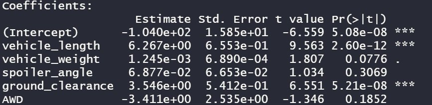

# MechaCar_Statistical_Analysis

AutosRUs is having production issues with its newest prototype, the MechaCar. The data analytics team has been given the production data to analyze and determine 
which variables are impacting the manufacturing team's progress.

## Linear Regression to Predict MPG
Multiple linear regression analysis was performed to identify which variables in the dataset predict the mpg of the MechaCar prototypes.

The three variables and their cooresponding cooficients below provided a non-random amount of variance to the mpg values in the dataset:
- Vehicle length (5.08e-08)
- Vehicle weight (2.60e-12)
- Ground clearance (5.21e-08)

The slope of the linear model is not considered to be zero, as a slope of zero would mean that the mpg of the MechaCar prototypes would be determined by random chance. As noted above, there are three variables that provided a non-random amount of variance to the mpg values.

Although this linear model identifies variables that provided a non-random amount of variance, the r-squared value is 0.7149, which leaves approximately 29% of the variability of mpg unexplained. To effectively predict the mgp of MechaCar prototypes, additional modeling should be completed.
