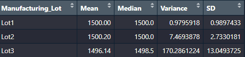

# MechaCar_Statistical_Analysis

AutosRUs is having production issues with its newest prototype, the MechaCar. The data analytics team has been given the production data to analyze and determine which variables are impacting the manufacturing team's progress.

## Linear Regression to Predict MPG
Multiple linear regression analysis was performed to identify which variables in the dataset predict the mpg of the MechaCar prototypes.

The three variables and their corresponding coefficients below provided a non-random amount of variance to the mpg values in the dataset:
- Vehicle length (5.08e-08)
- Vehicle weight (2.60e-12)
- Ground clearance (5.21e-08)

The slope of the linear model is not considered to be zero, as a slope of zero would mean that the mpg of the MechaCar prototypes would be determined by random chance. As noted above, there are three variables that provided a non-random amount of variance to the mpg values.

The linear model identifies variables that provided a non-random amount of variance, with an r-squared value of 0.7149. This means that approximately 71% of the variability of mpg can be explained.

## Summary Statistics on Suspension Coils
The design specifications for the MechaCar suspension coils dictate that the variance of the suspension coils must not exceed 100 pounds per square inch.

The current manufacturing data shows that when looking at all three lots combined, the variance is 62.29356 and the specification appears to be met. However, looking at the lots individually provides much needed insight. Lots 1 and 2 have very low variances, but Lot 3 is well above the 100 pound per square inch threshold. The data confirms that Lot 3 is not meeting the design specification.

## T-Tests on Suspension Coils
The t-tests performed on the combined lots, Lot 1, and Lot 2 all produced p-values greater than .05, signifying that the means are statistically similar to the population mean of 1,500 pounds per square inch.

Lot 3's t-test produced a p-value of 0.04168, signifying that the mean for this lot is statistically different to the population mean.

## Study Design: MechaCar vs Competition
Prior to releasing the protype of the MechaCar to the public, an additional statistical analysis needs to be completed to compare it against vehicles from other manufacturers. Of particular interest is the MSRP.

### Metrics to test
- Manufacturer's Suggested Retail Price (MSRP) (dependent variable)
- City MPG (independent variable)
- Highway MPG (independent variable)
- Safety rating (independent variable)
- Annual maintenance cost (independent variable)

### Hypothesis
- Null hypotheses: The MechaCar's MSRPs are priced competitively to vehicles made by other manufacturers based on fuel efficiency, safety rating, and annual maintenance cost.
- Alternative hypothesis: The MechaCar's MSRPs are not priced competitively to vehicles made by other manufacturers based on fuel efficiency, safety rating, and annual maintenance cost.

### Statistical test
Multiple linear regression analysis will be used to design a linear model that predicts the MSRP based on fuel efficiency, safety rating, and annual maintenance cost.

### Required Data
To complete the analysis, metrics from the major manufacturers with comparable models to the MechaCars from the past five years will be collected.
